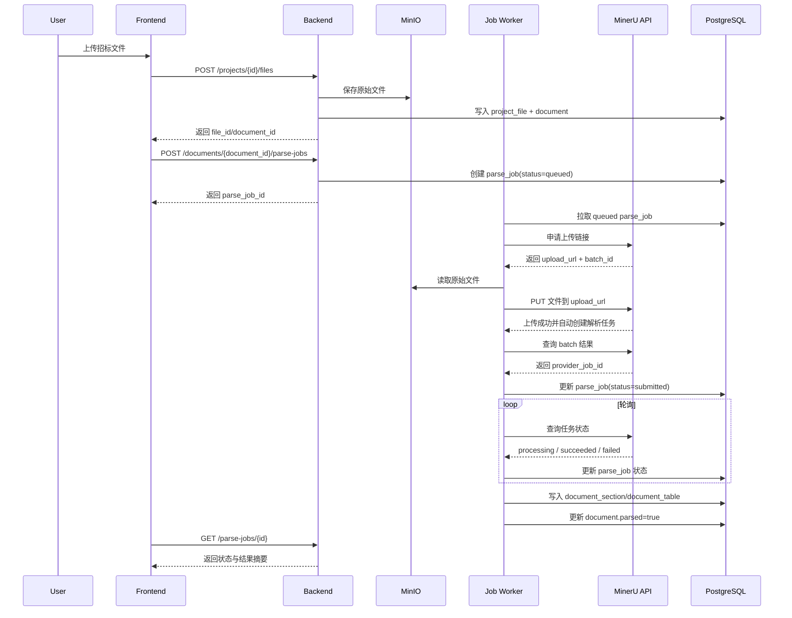

# MinerU 异步解析时序与接口设计

## 1. 目标

定义 `backend` 集成 MinerU 商业 API 的最小可用方案，确保上传文件、后端直传、异步解析、状态查询、结果落库和失败重试具备可实施的接口与状态机。

## 2. 已知约束

- MinerU 单文件接口不支持直接上传文件，只支持 URL 提交。
- MinerU 批量上传接口支持先申请上传链接，再由后端把文件直传到 MinerU。
- 单文件限制为 `200MB / 600页`。
- 后端不能把解析过程绑在同步 HTTP 请求上。
- 上传文件与解析结果都要回溯到 `project` 和 `document` 维度。

来源：

- <https://mineru.net/doc/docs/>
- <https://mineru.net/doc/docs/index_en/>

## 3. 核心设计

### 3.1 对象关系

- `project`
- `project_file`
- `document`
- `parse_job`
- `document_section`
- `document_table`
- `document_table_override`

其中：

- `project_file` 记录原始上传文件
- `document` 记录业务上的“待解析/已解析文档”
- `parse_job` 记录每一次对 MinerU 的提交、轮询、失败与重试

### 3.2 新增表建议

```sql
CREATE TABLE parse_job (
  id SERIAL PRIMARY KEY,
  document_id INT NOT NULL,
  provider TEXT NOT NULL DEFAULT 'mineru',
  provider_job_id TEXT,
  source_file_path TEXT NOT NULL,
  provider_batch_id TEXT,
  status TEXT NOT NULL,
  error_code TEXT,
  error_message TEXT,
  attempt_count INT NOT NULL DEFAULT 0,
  requested_by TEXT,
  started_at TIMESTAMP,
  finished_at TIMESTAMP,
  created_at TIMESTAMP DEFAULT now(),
  updated_at TIMESTAMP DEFAULT now()
);
```

状态建议：

- `queued`
- `validating`
- `uploading`
- `submitting`
- `submitted`
- `processing`
- `succeeded`
- `failed`
- `timeout`
- `cancelled`

## 4. 时序设计



## 5. 接口设计

### 5.1 上传文件

`POST /api/projects/{project_id}/files`

请求：

- `multipart/form-data`
- 字段：`file`
- 可选字段：`doc_type`

响应：

```json
{
  "file_id": 101,
  "document_id": 88,
  "file_name": "招标文件.pdf",
  "storage_path": "tender-raw/project-1/2026/03/14/招标文件.pdf",
  "parsed": false
}
```

校验：

- 文件大小不得超过业务阈值
- 文件页数和大小需在提交 MinerU 前再次校验

### 5.2 创建解析任务

`POST /api/documents/{document_id}/parse-jobs`

请求：

```json
{
  "force_reparse": false
}
```

响应：

```json
{
  "parse_job_id": 501,
  "document_id": 88,
  "status": "queued"
}
```

规则：

- 若已有 `queued/submitted/processing` 任务，默认拒绝重复提交
- `force_reparse=true` 时，允许创建新任务，但必须保留历史任务记录

### 5.3 查询解析任务状态

`GET /api/parse-jobs/{parse_job_id}`

响应：

```json
{
  "parse_job_id": 501,
  "document_id": 88,
  "provider": "mineru",
  "provider_batch_id": "batch-123",
  "provider_job_id": "mineru-task-123",
  "status": "processing",
  "attempt_count": 1,
  "error_code": null,
  "error_message": null,
  "started_at": "2026-03-14T20:00:00Z",
  "finished_at": null
}
```

### 5.4 查询解析结果摘要

`GET /api/documents/{document_id}/parse-result`

响应：

```json
{
  "document_id": 88,
  "parsed": true,
  "section_count": 126,
  "table_count": 14,
  "page_count": 238,
  "latest_parse_job_id": 501
}
```

### 5.5 重试解析任务

`POST /api/parse-jobs/{parse_job_id}/retry`

规则：

- 仅允许 `failed` 或 `timeout` 状态重试
- 重试创建新的 `parse_job`
- 原任务状态保留，不覆盖历史

## 6. Worker 设计

建议单独实现 `parse worker`，职责如下：

- 拉取 `queued` 任务
- 调用 MinerU 申请上传链接
- 从 MinIO 读取原始文件并直传到 MinerU
- 周期轮询状态
- 拉取结果并标准化
- 持久化 section/table/page
- 记录失败原因与重试次数

建议实现方式：

- 一期可使用简单轮询 worker
- 任务队列可先落在 `Redis`
- worker 与 `backend` 分离部署或以内置后台进程运行

## 7. 错误处理

### 7.1 失败分类

- `validation_error`
- `upload_url_unreachable`
- `provider_timeout`
- `provider_rate_limited`
- `provider_parse_failed`
- `provider_upload_failed`
- `result_normalization_failed`

### 7.2 重试策略

- 网络类与限流类错误可自动重试
- 结构化结果异常只允许有限重试
- 文件超限、格式非法等错误不重试

建议：

- 自动重试上限 `3`
- 退避策略：`30s -> 2m -> 10m`

## 8. 与现有实施计划的接口

需要回写到实施计划中的点：

- `Task 2` 数据库迁移补充 `parse_job`
- `Task 3` 增加 `task_poller.py`
- `Task 3` 的 API 从同步解析改为“创建任务 + 查询状态”
- 解析结果页调用 `GET /api/parse-jobs/{id}` 与 `GET /api/documents/{id}/parse-result`

## 9. 不纳入一期

- MinerU 回调 Webhook 集成
- 多 provider 文档解析路由
- 解析优先级队列
- 复杂 SLA 与计费统计
